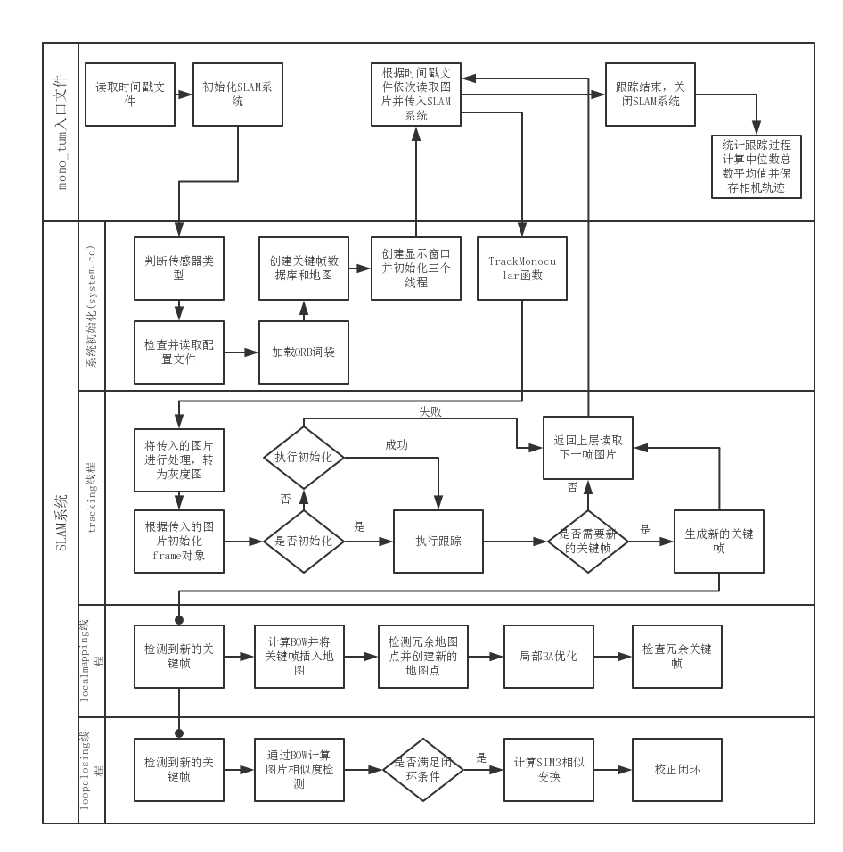
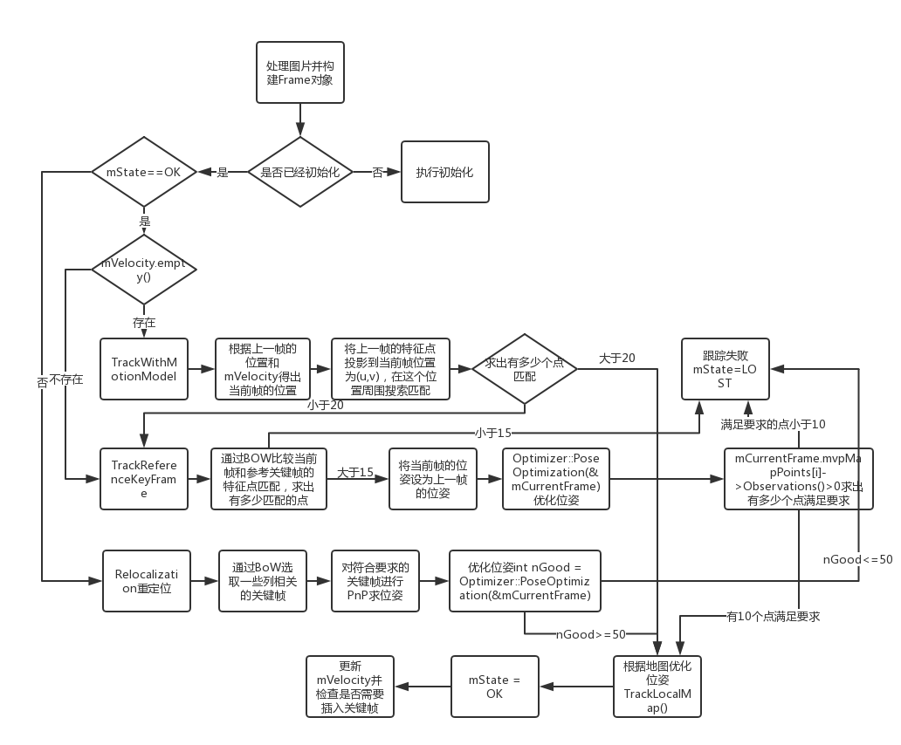
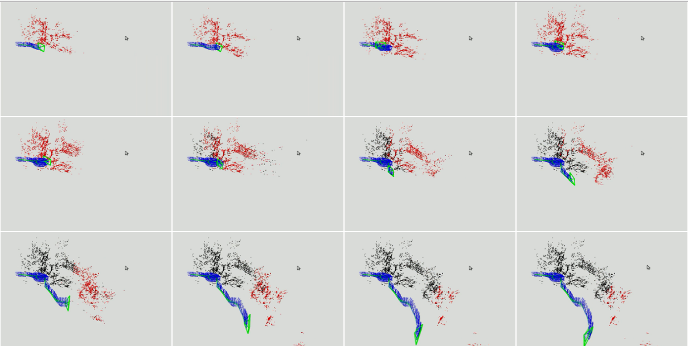
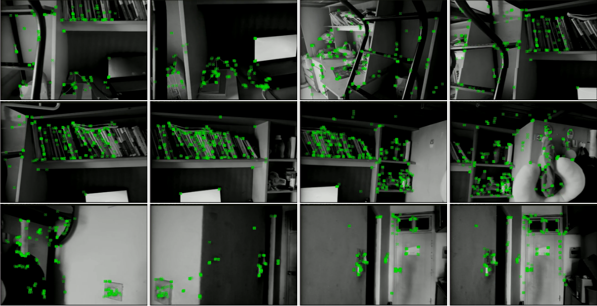

## 关于ORB-SLAM2的研究

> 目录介绍

``` bash
ORB-SLAM-RESEARCH
├── FlowChart # 算法流程图及运行时序列
├── pythonTools # 处理数据集的一些python小程序
│   ├── changeSize.py # 批量改变图片大小
│   ├── toTxt.py # 生成时间戳txt文件
│   └── vtp.py # 将视频逐帧处理成图片
├── ORB-SLAM2 # ORB-SLAM2源码
└── dataset # 数据集
```

> 编译
``` bash
cd ORB_SLAM2

chmod +x build.sh

./build.sh
```

> 运行
``` bash
the/path/to/entry the/path/to/vocabulary the/path/to/camera-config the/path/to/dataset

# example 在ORB_SLAM2目录下
./Examples/Monocular/mono_tum Vocabulary/ORBvoc.txt Examples/Monocular/TUM1.yaml /home/bill/Downloads/rgbd_dataset_freiburg1_xyz
```

> ORB-SLAM2 系统流程图


> tracking 线程流程图


> 运行时的稀疏地图序列


> 运行时的摄像头视图序列

